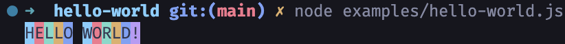

# Hello World

THIS IS WHERE DREAMS BEGIN!

## Installation

```bash
> npm install @strawhatx/hello-world
```

## Examples

```javascript
import { rainbow } from '@strawhatx/hello-world';

rainbow('HELLO WORLD!');
```

### output



## License

MIT
